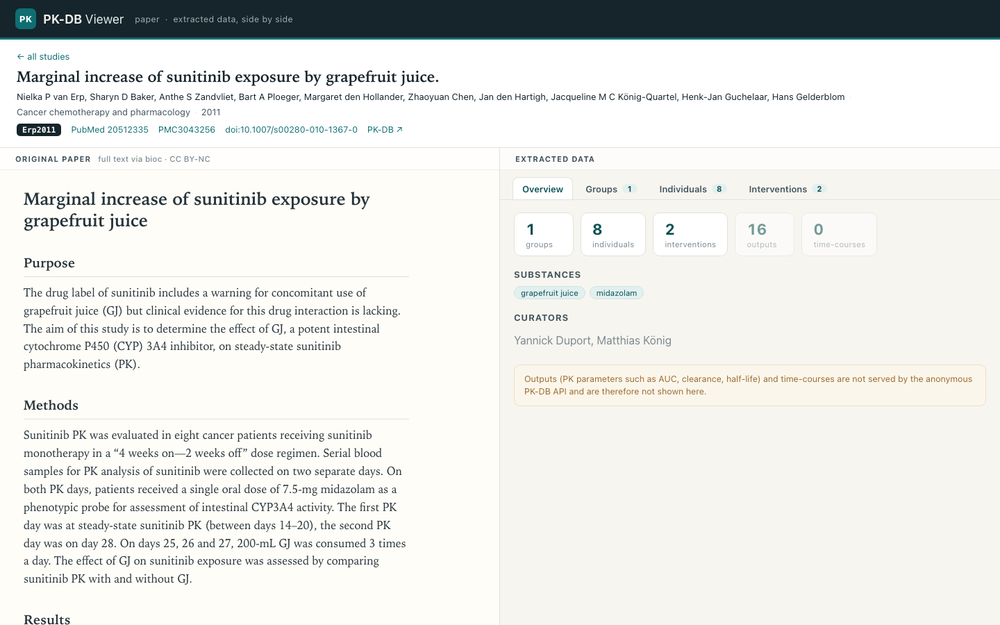

# PK-DB Viewer

A side-by-side viewer for open-access [PK-DB](https://pk-db.com/) pharmacokinetics
studies: the **original paper on the left**, the **extracted data on the right**.



## What it shows

For every open-access PK-DB study (those with `licence=open`):

- **Left pane** — the original paper rendered as markdown.
- **Right pane** — the data PK-DB extracted from that paper:
  - **Overview** — counts, substances, curator notes
  - **Groups** — subject groups and their characteristica (species, sex, age,
    weight, disease, medication, …)
  - **Individuals** — per-subject demographics
  - **Interventions** — dosing (substance, dose, route, form, timing)

The study list is searchable by title, drug, journal, or PMID.

## Data, and what is / isn't available

All data is **downloaded ahead of time** into `public/data/` — the app is fully
static and makes no API calls at runtime.

- **Extracted data** comes from the anonymous PK-DB REST API
  (`https://pk-db.com/api/v1/`). Note that **outputs** (PK parameters such as
  AUC, clearance, half-life), **time-courses**, and **scatters** are *not* served
  by the anonymous API — they require a curator login, and the official data
  export returns them empty for anonymous users — so they are not shown.
- **Paper text** is fetched per the project goal with
  [`pubmed-markdown`](https://github.com/shloknatarajan/pubmed-markdown) as the
  primary source. Because NCBI's PMC HTML pages are frequently behind a
  browser/reCAPTCHA check, the ingester falls back to NCBI's official **BioC**
  full-text API and then to **efetch NXML**, and finally to the abstract so the
  paper pane is never empty.
- `licence=open` in PK-DB means the *data* is open — not that the *paper*
  full text is in the PMC Open Access subset. Of the 88 open-access studies,
  ~31 have retrievable full text; the rest (mostly pre-2000 papers not in PMC)
  show their abstract. Each card/pane labels its source ("full text" vs
  "abstract only").

## Develop

```bash
npm install
npm run dev          # http://localhost:5173
```

## Re-run ingestion

Requires Python 3.11+. An NCBI email is recommended (`export NCBI_EMAIL=you@org`).

```bash
python3 -m venv ingest/.venv
ingest/.venv/bin/pip install pubmed-markdown
npm run ingest                                  # all open studies
ingest/.venv/bin/python ingest/ingest.py --limit 5      # smoke test
ingest/.venv/bin/python ingest/ingest.py --sid PKDB00249
ingest/.venv/bin/python ingest/ingest.py --upgrade-papers  # retry abstract-only papers
```

Output layout:

```
public/data/index.json          # study list for the picker
public/data/<sid>/study.json    # extracted data for one study
public/data/<sid>/paper.md      # the paper as markdown
```

## Build

```bash
npm run build        # -> dist/  (static, relocatable)
npm run preview
```

## Stack

Vite · React · TypeScript · react-markdown + remark-gfm. Python stdlib +
`pubmed-markdown` for ingestion.
