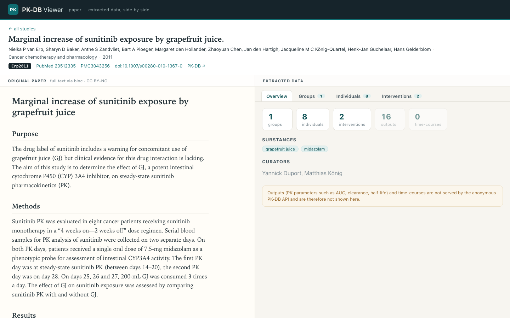

# PK-DB Viewer

A side-by-side viewer for open-access [PK-DB](https://pk-db.com/) pharmacokinetics
studies: the **original paper on the left**, the **extracted data on the right**.



## Repository layout

- `src/` — React/TypeScript viewer
- `app_data/` — generated PK-DB and proposed annotations served by Vite
- `research_data/` — offline research snapshots not shipped with the viewer
- `ingest/` — current and legacy ingestion pipelines
- `paper_screening/` — candidate-paper search and ranking CLI
- `paperclip_full_text_annotations/` — PK-DB annotations for papers with full text in Paperclip
- `pkdb-api/` — PK-DB API snapshots and source-identifier datasets
- `docs/` — design, evidence schema, and analysis reports

## What it shows

For every open-access PK-DB study (those with `licence=open`):

- **Left pane** — the original paper rendered as markdown.
- **Right pane** — the data PK-DB extracted from that paper:
  - **Overview** — counts, substances, curator notes
  - **Groups** — subject groups and their characteristica (species, sex, age,
    weight, disease, medication, …)
  - **Individuals** — per-subject demographics
  - **Interventions** — dosing (substance, dose, route, form, timing)
  - **Outputs** — pharmacokinetic parameters (AUC, clearance, half-life, Cmax,
    Tmax, Vd, …), grouped by measurement type
  - **Time-courses** — concentration-time curves, drawn as small inline charts

The study list is searchable by title, drug, journal, or PMID.

## Data, and what is / isn't available

All data is **downloaded ahead of time** into `app_data/pkdb_annotations/` — the app is fully
static and makes no API calls at runtime.

- **Findings come from a curated CSV dump, not the live API.** pk-db.com serves
  its measurement data (outputs, time-courses, scatters) from an Elasticsearch
  backend that returns **zero rows** to anonymous callers — the relational
  entities respond, but the actual PK numbers are unretrievable from the API. So
  the study set and all findings are ingested from the curated CSV export the
  PK-DB maintainers committed to their analysis repo:
  [`matthiaskoenig/pkdb_analysis`](https://github.com/matthiaskoenig/pkdb_analysis)
  → `tests/data/testdata_concise_false.zip` (a `pkdb_analysis` snapshot dated
  **2021-12-03**, 8 CSVs, 661 studies). The viewer uses the **56 `licence=open`**
  studies from that dump. Attribution required: Grzegorzewski et al., _Nucleic
  Acids Res._ 2021, doi:10.1093/nar/gkaa990.
- **Paper text** is fetched per the project goal with
  [`pubmed-markdown`](https://github.com/shloknatarajan/pubmed-markdown) as the
  primary source. Because NCBI's PMC HTML pages are frequently behind a
  browser/reCAPTCHA check, the ingester falls back to NCBI's official **BioC**
  full-text API and then to **efetch NXML**, and finally to the abstract so the
  paper pane is never empty.
- `licence=open` in PK-DB means the _data_ is open — not that the _paper_
  full text is in the PMC Open Access subset. Many of the open studies (mostly
  pre-2000 papers not in PMC) show their abstract rather than full text; each
  card/pane labels its source ("full text" vs "abstract only").

## Develop

```bash
npm install
npm run dev          # http://localhost:5173
```

## Find papers to annotate (keyword pipeline)

Rule-based (no LLM) search/filter for PKDB-annotatable candidates — see
[`paper_screening/README.md`](paper_screening/README.md):

```bash
ingest/.venv/bin/python -m paper_screening search --tier params --limit 100
ingest/.venv/bin/python -m paper_screening local --dir path/to/papers --limit 200
```

## Re-run ingestion

Requires Python 3.11+ (stdlib only for the dump; `pubmed-markdown` optional for
richer paper text). An NCBI email is recommended (`export NCBI_EMAIL=you@org`).

**Primary — from the curated CSV dump** (`ingest/ingest_dump.py`). Downloads the
`testdata_concise_false.zip` snapshot, builds the 56 open studies with full
findings, and reuses any already-saved paper/reference:

```bash
ingest/.venv/bin/python ingest/ingest_dump.py            # all 56 open studies
ingest/.venv/bin/python ingest/ingest_dump.py --limit 3  # smoke test
ingest/.venv/bin/python ingest/ingest_dump.py --sid PKDB00024
ingest/.venv/bin/python ingest/ingest_dump.py --no-paper # data only, skip NCBI
```

**Legacy — live anonymous API** (`ingest/ingest.py`, `npm run ingest`). Kept for
reference; it cannot retrieve outputs/time-courses (the API returns them empty),
so it only produces groups/individuals/interventions.

**Complete raw snapshot** (`ingest/ingest_raw_dump.py`). Builds a
study-partitioned dump of all 661 studies without fetching paper Markdown or
filtering non-normalized rows. Reference metadata is enriched with saved
PMID/PMCID/DOI mappings when available:

```bash
python ingest/ingest_raw_dump.py
```

The generated files are written to `research_data/raw_data/`: `index.json`, the global
`info_nodes.json`, and one study JSON organized by source identifier type:

```text
research_data/raw_data/
  pkdb/PKDB00024/study.json
  pmid/10340911/study.json
  legacy/Bochner1999/study.json
```

Output layout:

```
app_data/pkdb_annotations/index.json          # study list for the picker
app_data/pkdb_annotations/<sid>/study.json    # extracted data + findings for one study
app_data/pkdb_annotations/<sid>/paper.md      # the paper as markdown
```

## Build

```bash
npm run build        # -> dist/  (static, relocatable)
npm run preview
```

## Stack

Vite · React · TypeScript · react-markdown + remark-gfm. Python stdlib +
`pubmed-markdown` for ingestion.
